# Модель данных

Схема строится из реально развёрнутой MariaDB после применения миграций, а не
поддерживается вручную. После изменения миграций выполните
`make schema-diagram`; `make schema-diagram-check` завершится ошибкой, если
диаграмма в Git устарела.

```mermaid
erDiagram
    audit_events {
        bigint(20)_unsigned id PK
        varchar(64) event_type
        varchar(64) entity_type
        bigint(20)_unsigned entity_id
        bigint(20)_unsigned actor_id FK "-> users.id"
        varchar(16) rule_id
        longtext payload_json
        datetime(6) created_at
    }
    break_glass_rate_limits {
        varchar(67) scope_key PK
        int(11)_unsigned failure_count
        datetime(6) window_started_at
        datetime(6) updated_at
    }
    document_download_links {
        bigint(20)_unsigned id PK
        bigint(20)_unsigned document_version_id FK "-> request_document_versions.id"
        char(64) token_hash
        datetime(6) created_at
    }
    expert_opinions {
        bigint(20)_unsigned id PK
        bigint(20)_unsigned request_id FK "-> requests.id"
        int(11)_unsigned revision
        bigint(20)_unsigned expert_id FK "-> users.id"
        text body
        bigint(20)_unsigned document_version_id FK "-> request_document_versions.id"
        datetime(6) created_at
    }
    idempotency_requests {
        bigint(20)_unsigned id PK
        bigint(20)_unsigned actor_id FK "-> users.id"
        varchar(8) http_method
        varchar(255) route
        char(64) key_hash
        char(64) request_hash
        smallint(6)_unsigned status_code
        text response_json
        varchar(2048) location
        datetime(6) created_at
        datetime(6) expires_at
    }
    migration {
        varchar(180) version PK
        int(11) apply_time
    }
    notification_outbox {
        bigint(20)_unsigned id PK
        bigint(20)_unsigned request_id FK "-> requests.id"
        varchar(64) event_type
        varchar(255) recipient_email
        varchar(255) recipient_name
        varchar(255) subject
        text body
        json payload_json "semantic data; no bearer credentials"
        varchar(16) status
        int(11)_unsigned attempts
        datetime(6) next_attempt_at
        text last_error
        datetime(6) created_at
        datetime(6) sent_at
    }
    requests {
        bigint(20)_unsigned id PK
        bigint(20)_unsigned number
        varchar(128) legacy_id
        bigint(20)_unsigned initiator_id FK "-> users.id"
        varchar(255) department_name
        varchar(128) department_external_id
        varchar(32) department_source
        varchar(32) status
        varchar(2000) product_name
        varchar(500) manufacturer
        varchar(500) supplier
        int(11)_unsigned sample_quantity "NULL только для архивного импорта"
        text legacy_sample_quantity_raw "NULL, исходное значение Б24"
        text test_method
        int(11)_unsigned revision
        int(11)_unsigned lock_version
        varchar(16) color
        datetime(6) created_at
        datetime(6) updated_at
    }
    request_assignments {
        bigint(20)_unsigned id PK
        bigint(20)_unsigned request_id FK "-> requests.id"
        varchar(16) assignment_type
        bigint(20)_unsigned user_id FK "-> users.id"
        bigint(20)_unsigned assigned_by FK "-> users.id"
        datetime(6) valid_from
        datetime(6) valid_to
    }
    request_comments {
        bigint(20)_unsigned id PK
        bigint(20)_unsigned request_id FK "-> requests.id"
        bigint(20)_unsigned author_id FK "-> users.id"
        text body
        datetime(6) created_at
    }
    request_documents {
        bigint(20)_unsigned id PK
        bigint(20)_unsigned request_id FK "-> requests.id"
        varchar(32) document_type
        varchar(255) title
        bigint(20)_unsigned created_by FK "-> users.id"
        datetime(6) deleted_at
        bigint(20)_unsigned deleted_by FK "-> users.id"
        datetime(6) created_at
    }
    request_document_versions {
        bigint(20)_unsigned id PK
        bigint(20)_unsigned document_id FK "-> request_documents.id"
        int(11)_unsigned version
        varchar(80) storage_key
        varchar(255) original_name
        varchar(100) mime_type
        bigint(20)_unsigned size_bytes
        char(64) sha256
        bigint(20)_unsigned uploaded_by FK "-> users.id"
        datetime(6) created_at
        datetime(6) deleted_at
    }
    request_number_sequence {
        tinyint(3)_unsigned id PK
        bigint(20)_unsigned value
    }
    request_transitions {
        bigint(20)_unsigned id PK
        bigint(20)_unsigned request_id FK "-> requests.id"
        bigint(20)_unsigned actor_id FK "-> users.id"
        varchar(32) from_status
        varchar(32) to_status
        varchar(32) action
        text reason
        bigint(20)_unsigned document_version_id FK "-> request_document_versions.id"
        varchar(16) rule_id
        datetime(6) created_at
    }
    roles {
        int(10)_unsigned id PK
        varchar(64) code
        varchar(128) name
    }
    security_checks {
        bigint(20)_unsigned id PK
        bigint(20)_unsigned request_id FK "-> requests.id"
        bigint(20)_unsigned expert_opinion_id FK "-> expert_opinions.id"
        bigint(20)_unsigned officer_id FK "-> users.id"
        varchar(16) decision
        text reason
        datetime(6) created_at
    }
    users {
        bigint(20)_unsigned id PK
        varchar(128) ad_login
        varchar(255) display_name
        varchar(255) email
        varchar(255) position
        varchar(255) department
        tinyint(1) is_active
        datetime(6) last_login_at
        datetime(6) last_activity_at
        datetime(6) created_at
        datetime(6) updated_at
    }
    user_roles {
        bigint(20)_unsigned user_id PK,FK "-> users.id"
        int(11)_unsigned role_id PK,FK "-> roles.id"
        bigint(20)_unsigned assigned_by FK "-> users.id"
        datetime(6) created_at
    }
    users ||--o{ audit_events : "actor_id"
    request_document_versions ||--o{ document_download_links : "document_version_id"
    requests ||--o{ expert_opinions : "request_id"
    users ||--o{ expert_opinions : "expert_id"
    request_document_versions ||--o{ expert_opinions : "document_version_id"
    users ||--o{ idempotency_requests : "actor_id"
    requests ||--o{ notification_outbox : "request_id"
    users ||--o{ requests : "initiator_id"
    requests ||--o{ request_assignments : "request_id"
    users ||--o{ request_assignments : "user_id"
    users ||--o{ request_assignments : "assigned_by"
    requests ||--o{ request_comments : "request_id"
    users ||--o{ request_comments : "author_id"
    requests ||--o{ request_documents : "request_id"
    users ||--o{ request_documents : "created_by"
    users |o--o{ request_documents : "deleted_by"
    request_documents ||--o{ request_document_versions : "document_id"
    users ||--o{ request_document_versions : "uploaded_by"
    requests ||--o{ request_transitions : "request_id"
    users ||--o{ request_transitions : "actor_id"
    request_document_versions |o--o{ request_transitions : "document_version_id"
    requests ||--o{ security_checks : "request_id"
    expert_opinions ||--o{ security_checks : "expert_opinion_id"
    users ||--o{ security_checks : "officer_id"
    users ||--o{ user_roles : "user_id"
    roles ||--o{ user_roles : "role_id"
    users |o--o{ user_roles : "assigned_by"
```

<!-- schema-diagram:start -->

<!-- generated from migrated MariaDB by scripts/gen_schema_diagram.py -->

<!-- schema-diagram:end -->
